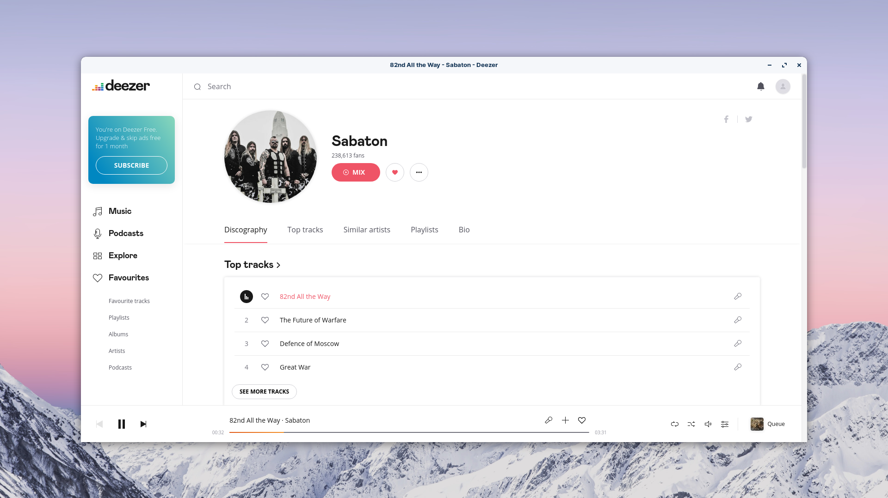
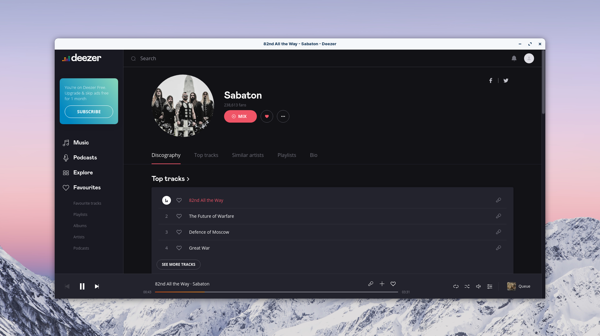

# Deeznix

Deeznix is an unoffical Deezer desktop application for Ubuntu and Fedora. It's really just the Deezer website wrapped up in Electron.

## Getting Started

### Install from Package

1. Download `deeznix-$version_amd64.deb` for Ubuntu or `deeznix-$version_amd64.rpm` for Fedora from the release section
2. Run `sudo apt install ./deeznix-$version_amd64.deb` for Ubuntu or `sudo dnf install ./deeznix-$version_amd64.rpm` for Fedora

### Install from Source

#### Prerequisites

1. Run `sudo apt install dkpg fakeroot rpm`
2. Run `npm install`

#### Testing

1. Run `npm start`

#### Packaging

1. Run `npm run make`
