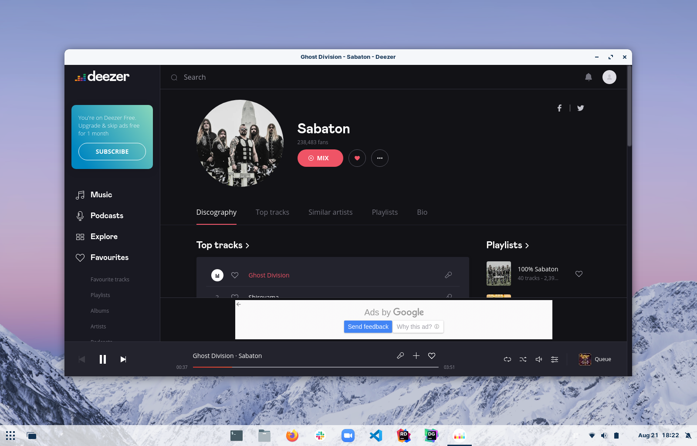

# Deeznix

Deeznix is an unoffical Deezer desktop application for Ubuntu and Fedora. It's really just the Deezer website wrapped up in Electron.

## Getting Started

### Prerequisites

1. Run `sudo apt install dkpg fakeroot rpm`
2. Run `npm install`

### Testing

1. Run `npm start`

### Packaging

1. Run `npm run make`

## Known Issues

1. Music must be paused before you can close the application. This is because the Deezer website prompts you to confirm that you'd like to leave the page when music is playing and that prompt isn't visible in Deeznix.
2. Desktop notifications do not work.
